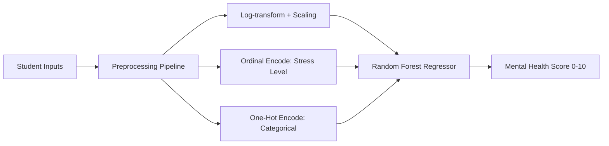

<div align="center">


<br/>

[](https://www.python.org/)
[](https://streamlit.io/)
[](https://scikit-learn.org/)
[](https://plotly.com/)
[](LICENSE)

[](.)
[](.)


<a href="https://student-mental-health-predictor-xdcutxikw8qd8mwsqv8wc4.streamlit.app/"><b>Live Demo</b></a> ·
<a href="#-features"><b>Features</b></a> ·
<a href="#-installation--run-locally"><b>Installation</b></a> ·
<a href="#-model-performance"><b>Model Performance</b></a> ·
<a href="#-author"><b>Author</b></a>

</div>

<br/>

## 📌 About the Project

A machine-learning powered **Streamlit web app** that predicts a student's **Mental Health Score (0–10)** from their social media usage, sleep, study habits, physical activity and stress level — trained on a 5,000-student dataset and served through an interactive, animated UI with live gauges and charts.

> 🎯 **Goal:** Understand how digital habits and lifestyle factors relate to student well-being, and turn that analysis into a real, usable prediction tool.

<br/>

## 🚀 Live Demo

<div align="center">

**[👉 Try the app here](https://student-mental-health-predictor-xdcutxikw8qd8mwsqv8wc4.streamlit.app/)** &nbsp;*(replace with your deployed Streamlit Cloud link)*


*(Add a screen-recording GIF of your running app at `assets/demo.gif` — tools like [ScreenToGif](

https://github.com/user-attachments/assets/34ab3a59-754e-4a0d-8fa5-0f6cd74fb1cd

) work great for this)*

</div>

<br/>

## ✨ Features

| | |
|---|---|
| 🔮 **Live Prediction** | Enter a student's habits → get an instant Mental Health Score with an animated gauge |
| 📊 **Dataset Insights** | Upload the CSV for live, interactive histograms, box plots, scatter plots & correlation heatmaps |
| 🤖 **Model Comparison** | Real R² / MAE / RMSE metrics comparing Linear Regression vs Random Forest (default & tuned) |
| 🎨 **Modern UI** | Glassmorphism cards, animated gradient backgrounds, gauge charts, hover effects |
| ⚡ **Zero Setup for Users** | Deployed as a one-click web app — no installs needed to try it |

<br/>

## 🧠 How It Works



<br/>

## 📈 Model Performance

| Model | R² (Test) | R² (Train) | MAE | RMSE |
|---|:---:|:---:|:---:|:---:|
| Linear Regression | 0.740 | 0.724 | 0.536 | 0.676 |
| **Random Forest (default)** ✅ | **0.877** | 0.981 | **0.348** | **0.464** |
| Random Forest (tuned) | 0.866 | 0.955 | 0.369 | 0.486 |

✅ **Deployed model:** Random Forest (default) — best balance of accuracy and generalization.

<br/>

## 🛠️ Tech Stack

<div align="center">


</div>

<br/>

## 📁 Project Structure

```
mental_health_app/
│
├── app.py                     # Streamlit application (UI + prediction logic)
├── requirements.txt           # Python dependencies
├── Mental_Health_Model.pkl    # Trained Random Forest pipeline (joblib)
├── Student_Social_Media_And_Mental_Health_Impact.ipynb   # EDA + model training notebook
└── README.md                  # You are here
```

<br/>

## ⚙️ Installation & Run Locally

```bash
# 1. Clone the repository
git clone https://github.com/anandpal3244-coder/Student_Social_Media_And_Mental_Health_Impact.git
cd Student_Social_Media_And_Mental_Health_Impact

# 2. Create a virtual environment
python -m venv .venv

# 3. Activate it
#   Windows:
.venv\Scripts\activate
#   macOS / Linux:
source .venv/bin/activate

# 4. Install dependencies
pip install -r requirements.txt

# 5. Run the app
streamlit run app.py
```

The app opens automatically at **http://localhost:8501**

<br/>

## 🌐 Deployment

Deployed free on **Streamlit Community Cloud**:

1. Push this repo to GitHub (includes `app.py`, `requirements.txt`, `Mental_Health_Model.pkl`)
2. Go to [share.streamlit.io](https://share.streamlit.io) → **New app**
3. Select this repo → branch `main` → main file `app.py` → **Deploy**

<br/>

## 🗺️ Roadmap

- [ ] Add SHAP-based feature-importance explanations per prediction
- [ ] Add a "compare two students" side-by-side view
- [ ] Multi-language support
- [ ] Downloadable PDF prediction report

<br/>

## 🤝 Contributing

Contributions, issues and feature requests are welcome!
Feel free to check the [issues page](../../issues) or open a pull request.

<br/>

## 📄 License

Distributed under the **MIT License**. See `LICENSE` for details.

<br/>

## 👤 Author

<div align="center">

### Anand Kumar
**Data Analyst** — Python · SQL · Power BI · Tableau · Streamlit

[](https://github.com/anandpal3244-coder)
[](https://www.linkedin.com/in/anand-pal-6a657b393/)
[](mailto:anandpal3244@gmail.com)

<br/>


<br/><br/>

**Other Projects**

[](https://student-career-success-prediction-n4xvvdute4gcwqjrwgyjdp.streamlit.app/)
[](https://movie-recommender-jdts3fvmdqq3vril8uh8sd.streamlit.app/)
[](https://public.tableau.com/app/profile/anand.kumar1736/viz/RetailSalesPerformanceDashboard_17820255179240/RetailSalesPerformanceDashboard?publish=yes)
[](https://github.com/anandpal3244-coder/Music-Store-SQL-Analysis)

</div>

<br/>


